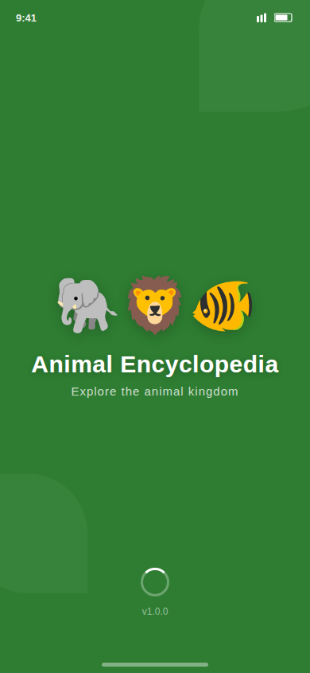
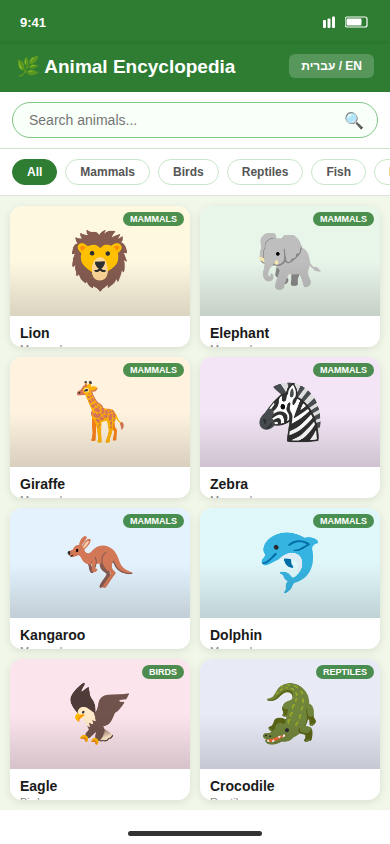
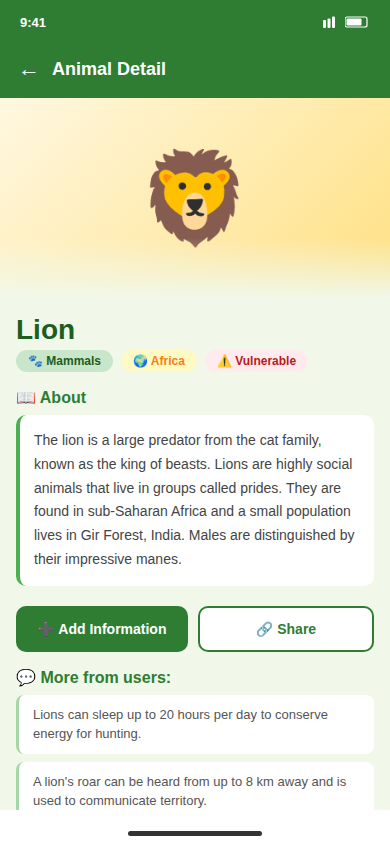

# Animal Info App — Animal Encyclopedia

[](https://opensource.org/licenses/MIT)

An Android animal encyclopedia app with bilingual support (English and Hebrew). Browse animals by category, search by name, toggle between list and grid views, view detailed animal facts, share information, and contribute new facts via a dialog.

## Screenshots

| Splash Screen | Animal Grid | Animal Detail |
|---|---|---|
|  |  |  |

## Features

- **Splash Screen** — Animated introduction screen shown on first launch
- **Bilingual support** — Toggle between English and Hebrew at any time; all animal names and UI labels switch accordingly
- **Category Selector** — Filter the displayed animals by category (e.g. mammals, birds, reptiles)
- **Live Search** — `SearchBar` composable filters animals in real time by name as you type
- **List / Grid View Toggle** — Switch between a scrollable `AnimalList` and a card-based `AnimalGrid` layout
- **Animal Detail Screen** — Full detail view (`AnimalDetails`) with facts and information for the selected animal
- **Share** — Share animal facts to other apps via the Android share sheet (`ShareUtils`)
- **Add Contribution Dialog** — Submit additional facts for any animal via `AddContributionDialog`
- **MVVM architecture** — `AnimalViewModel` manages search query, language preference, category selection, and the animal dataset

## Tech Stack

| Layer | Technology |
|---|---|
| Language | Kotlin |
| UI | Jetpack Compose (Material 3, dynamic color) |
| Architecture | MVVM — `AnimalViewModel` + Compose state |
| Build system | Gradle with Kotlin DSL + Version Catalog |
| Min SDK | 24 |
| Target / Compile SDK | 34 |
| AGP | 8.6.0 |
| Kotlin | 1.9.0 |

## Project Structure

```
AnimalInfoApp/
├── app/
│   └── src/main/
│       ├── java/com/example/animalinfoapp/
│       │   ├── MainActivity.kt          # Entry point; splash → main
│       │   ├── AnimalInfoApp.kt         # Root composable; layout orchestration
│       │   ├── AnimalViewModel.kt       # Business logic and app state
│       │   ├── AnimalItem.kt            # Animal data model
│       │   ├── AnimalList.kt            # List-mode composable
│       │   ├── AnimalGrid.kt            # Grid-mode composable
│       │   ├── AnimalGridItem.kt        # Single grid cell composable
│       │   ├── AnimalDetails.kt         # Detail screen composable
│       │   ├── CategorySelector.kt      # Category filter row
│       │   ├── SearchBar.kt             # Search input + language/view-toggle controls
│       │   ├── SplashScreen.kt          # Animated splash composable
│       │   ├── AddContributionDialog.kt # Contribution input dialog
│       │   ├── ShareUtils.kt            # Android share-sheet helper
│       │   └── ui/theme/               # Material 3 theme
│       └── AndroidManifest.xml
├── gradle/
│   ├── libs.versions.toml
│   └── wrapper/
└── settings.gradle.kts
```

## How to Build

### Prerequisites

- Android Studio Hedgehog (2023.1.1) or newer
- Android SDK with API level 34 platform installed
- JDK 17+

### Steps

1. Clone the repository and open the `AnimalInfoApp` folder in Android Studio.
2. Allow Gradle to sync — all dependencies are resolved automatically.
3. Connect a device or start an AVD (API 24+).
4. Click **Run > Run 'app'** or press `Shift+F10`.

### Command-line build

```bash
./gradlew assembleDebug
```

Output APK: `app/build/outputs/apk/debug/app-debug.apk`

## Notes

- The app uses `dynamicLightColorScheme` (Material You) on Android 12+ (API 31+), adapting colors to the device wallpaper. On older devices a standard Material 3 color scheme is applied.

---

## 🇮🇱 תיעוד בעברית

### מה הפרויקט עושה

אפליקציית אנציקלופדיה לבעלי חיים לאנדרואיד, התומכת בשתי שפות — עברית ואנגלית. המשתמש יכול לגלוש בין בעלי חיים לפי קטגוריה, לחפש לפי שם, לעבור בין תצוגת רשת לתצוגת רשימה, לצפות בפרטים ועובדות על כל חיה, לשתף מידע עם אפליקציות אחרות ואף להוסיף עובדות חדשות דרך דיאלוג ייעודי.

מעבר בין עברית לאנגלית מתבצע בלחיצה אחת — כל שמות החיות ורכיבי הממשק מתעדכנים מיידית.

### טכנולוגיות

- **Kotlin** — שפת הפיתוח
- **Jetpack Compose (Material 3)** — בניית ממשק המשתמש, כולל צבעים דינמיים (Material You)
- **MVVM** — ארכיטקטורה עם `AnimalViewModel` לניהול מצב האפליקציה
- **Gradle עם Kotlin DSL** — מערכת בנייה וניהול גרסאות
- **Min SDK 24, Target SDK 34** — תמיכה רחבה במכשירים

### הוראות התקנה והפעלה

**דרישות מוקדמות:**
- Android Studio Hedgehog (2023.1.1) ומעלה
- Android SDK עם API 34
- JDK 17+

**הפעלה דרך Android Studio:**
1. פתחו את תיקיית `AnimalInfoApp` ב-Android Studio
2. המתינו לסיום סנכרון Gradle
3. חברו מכשיר אנדרואיד או הפעילו אמולטור (API 24+)
4. לחצו על **Run > Run 'app'** או הקישו `Shift+F10`

**בנייה מהטרמינל:**
```bash
./gradlew assembleDebug
```
קובץ ה-APK נוצר בנתיב: `app/build/outputs/apk/debug/app-debug.apk`

### מבנה הפרויקט

```
AnimalInfoApp/
├── app/src/main/java/com/example/animalinfoapp/
│   ├── MainActivity.kt          # נקודת כניסה — מסך פתיחה ומעבר לראשי
│   ├── AnimalViewModel.kt       # לוגיקה עסקית ומצב האפליקציה
│   ├── AnimalItem.kt            # מודל הנתונים של חיה
│   ├── AnimalList.kt            # תצוגת רשימה
│   ├── AnimalGrid.kt            # תצוגת רשת
│   ├── AnimalDetails.kt         # מסך פרטי חיה
│   ├── CategorySelector.kt      # סינון לפי קטגוריה
│   ├── SearchBar.kt             # חיפוש + מתג שפה/תצוגה
│   ├── SplashScreen.kt          # מסך פתיחה מונפש
│   ├── AddContributionDialog.kt # דיאלוג הוספת עובדה
│   └── ShareUtils.kt            # שיתוף תוכן לאפליקציות אחרות
└── gradle/libs.versions.toml    # קטלוג גרסאות תלויות
```
